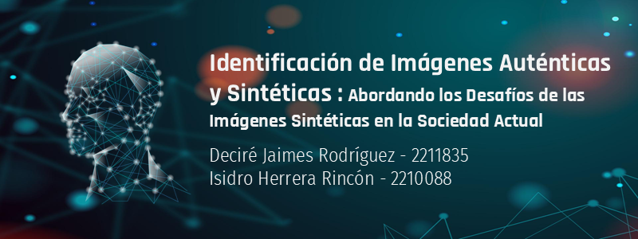

# Identificación de Imágenes Auténticas y Sintéticas : Abordando los Desafíos de las Imágenes Sintéticas en la Sociedad Actual

**Autores:**
Deciré Jaimes Rodríguez, Isidro Herrera Rincón

**Objetivo:** 
Desarrollar un modelo capaz de distinguir imágenes de rostros reales de aquellas generadas por inteligencia artificial, utilizando técnicas de procesamiento de imágenes y clasificación binaria.

**Datasets usados:** https://www.kaggle.com/datasets/hamzaboulahia/hardfakevsrealfaces/code & https://www.kaggle.com/datasets/kaustubhdhote/human-faces-dataset

**Modelos:** CNN, Sequential, MobileNetV2, EfficientNetB0, MobileNetV3

**Vídeo:** 
